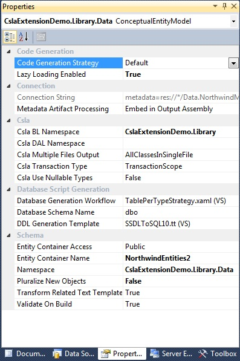
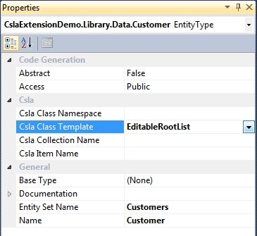
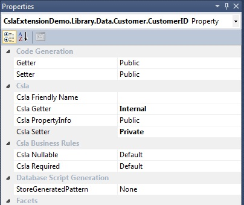

# Custom Properties

Work in progress...

When CslaExtension is installed, custom properties are added to objects in the Entity Framework model. Custom properties are used by the CslaExtension T4 template in order to generate CSLA classes.

## EntityModel Properties

Entity Model container is a container for other EF objects. You can view container properties by clicking on the empty area of EF model designer, or by selecting Model item in the ModelBrowser window.

**Csla BL Namespace**
This is the namespace for generated CSLA classes. For details see [Namespaces](Namespaces)

**Csla DAL Namespace**
This is the namespace where entity framework objects (data) are generated. For details see [Namespaces](Namespaces)

**Csla Multiple Files Output**
By default, all the code is generated in a single file. If you want to generate code in multiple files, you should set this property. Files are generated under CslaExtension.tt file in the Solution Explorer.
* AllClassesInSingleFile: this is the default value. If this option is selected, all classes will be generated in a single file named CslaExtension.cs
* EachClassInSeparateFile: Each CSLA class will be generated in separate file named ClassName.cs. This option is introduced in order to support some source control systems and multiuser scenarios.
* CommonAndServerCodeForEachClass: Use this option for Silvelight development. Each class will be generated in two files named ClassName.cs and ClassName.Server.cs, and then you can link ClassName.cs in your SL project.

**Csla Transaction Type**
Transaction type for generated Csla classes. 
Available options:
* TransactionScope
* EnterpriseServices
* Manual

**Csla Use Nullable Types**
By default, generated Csla properties inherit nullable types from the EF model. If the entity property allows null values, the generated property will also be a nullable type (int?, decimal? etc). However, there are some scenarios where you want all the properties in your model classes to be nullable types. In that case you should set CslaUseNullableTypes to True.
If you want to set single property to be a nullable type, you can use custom properties of an EntityProperty object.

## EntityType properties

EntityType represents one entity in the EF model, and is used for generation of CSLA business classes. Using EntityType properties we define which business classes will be generated. 

**Csla Class Namespace**

Csla Class Namespace is used when you want to generate a business class in a custom namespace ( eg. generate "User" business class in App.Security namespace). This property overrides Csla BL Namespace of the EntityContainer.
 
**Csla Class Template**

This property defines which business classes will be generated. You can choose one of following templates: 
* EditableRoot
* EditableRootList
* EditableChild
* EditableChildList
* ReadOnlyRoot
* ReadOnlyRootList
* ReadOnlyChild
* ReadOnlyChildList

If selected template is list, then two classes will be generated; one for single business object and one for collection of objects. By default, single object will be named same as the EntityType, and list will get suffix _List_ (eg. single object name is Customer, collection name will be CustomerList). 
For more details see [Class templates](Class-templates).

**Csla Collection Name** 
Csla Collection Name overrides default naming schema. Using this property you can define name of the generated collection. If selected template is not a list, this property is not used. (eg. by default, generated collection name would be CustomerList, but instead we want to set collection name to "Customers")

**Csla  Item Name**
Csla Item Name overrides the default name of the generated single object.

## EntityProperty properties

