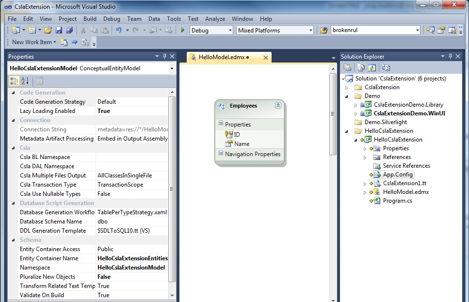
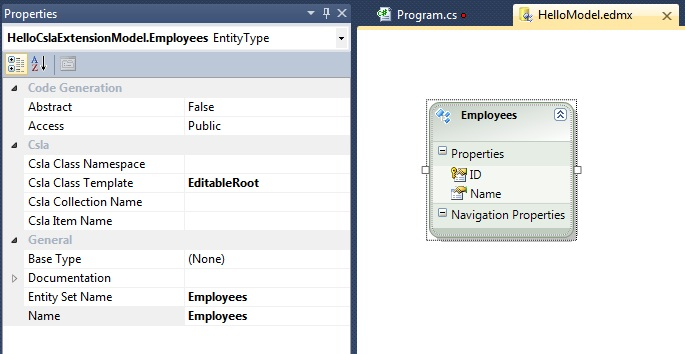

# Creating first CslaExtension application

These are the steps for creating a simple CslaExtension application:

## Prerequisites

- Download latest CSLA library ([http://www.lhotka.net/cslanet/Download.aspx](http://www.lhotka.net/cslanet/Download.aspx)) and extract it to some location on your disk
- Install CslaExtension (see [Installation](Installation) for details)

## Database setup

: - Using SqlServer Management studio connect to the server. For this demo I'll use SqlExpress server installed on my local machine. 
: - Create a new database named HelloCslaExtension.
: - Right click on the database and select "New Query"
: - Paste and execute this SQL to create a new table in the database:
{{
CREATE TABLE [dbo](dbo).[Employees](Employees)(
	[ID](ID) [int](int) NOT NULL,
	[Name](Name) [varchar](varchar)(50) NOT NULL,
	 CONSTRAINT [PK_Employees](PK_Employees) PRIMARY KEY CLUSTERED 
	(
		[ID](ID) ASC
	)
)
}}

## Entity Framework model

- Start Visual Studio and create a new Console project named HelloCslaExtension
- Add a reference to the CSLA library: right click on the project -> Add  Reference... -> locate Csla\Server\Csla.dll and add it to your project

- Right click on the project and choose Add New Item -> Data -> Ado.Net Entity Data Model and name it HelloModel.edmx
: - Choose Model Contents -> Generate from database
: - Choose Your Data Connection -> New Connection: _Server name=.\sqlexpress; Use Windows Authentication; Database name=HelloCslaExtension_
: - Choose Your Database Objects: select all tables and leave everything else as it is
: - Click Finish and Visual Studio creates and displays the model

## Code generation

- Right click on the empty area of the model and choose Add code generation item -> Visual C# items -> CslaExtension.Template and click Add
- **Important: click on the empty area of the model and display properties window (F4). If the property "Code Generation Strategy" is set to None, select "Default"**

- Now your project should look like this:

 

- Select Employees object on the EF model and choose EditableRoot of the Csla Class Template 

## Writing code

- Open Program.cs class and write following code in the Main method

{{
        static void Main(string args)
        {
            //Writing one employee to the database
            HelloCslaExtensionModel.Employees writeEmployee = HelloCslaExtensionModel.Employees.New();
            writeEmployee.ID = 1;
            writeEmployee.Name = "Test Employee";
            writeEmployee.Save();

            //Reading one employee from the database
            HelloCslaExtensionModel.Employees readEmployee = HelloCslaExtensionModel.Employees.Get(1);
            Console.WriteLine("Employee name: {0}", readEmployee.Name);
            Console.ReadLine();
        }
}}

That's it, we have created our first CslaExtension application.