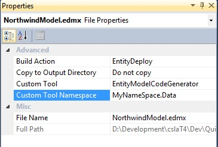
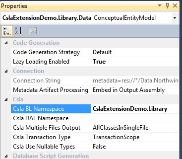

# Namespaces

There are two namespaces that are important when using CslaExtension: Data and BusinessLogic.

## Data Namespace
Data is the namespace where Entity Framework entities are generated. Data namespace is generated by the Entity Framework model and by default is constructed from the edmx file location. For example: if your Model.edmx file is located in project MyApplication.Data, the namespace used for generated entities will be _MyApplication.Data_. If the edmx file is located in subfolder of the project MyApplication.Data\Entities, the namespace will be _MyApplication.Data.Entities_.
You can change the default data namespace by setting property "Custom Tool Namespace" of the edmx file. In the Solution Explorer select edmx file and show Properties window (F4):

## BusinessLogic Namespace
BL Namespace is the namespace of generated CSLA objects. You should set the namespace for generated objects by using  _CSLA BL Namespace_  property of the Entity Framework designer. Open edmx designer, click on the empty area and open Properties window. 
If the CslaExtension.tt is not located in the same directory with the edmx file, you must set the _CSLA DAL Namespace_ property to the namespace of generated data entities.

