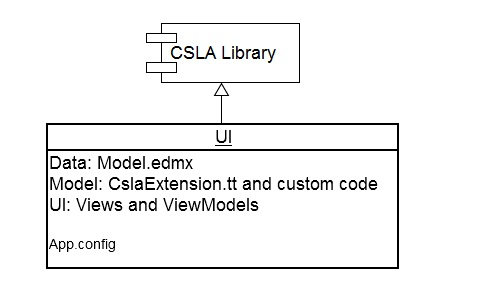
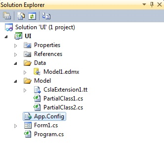
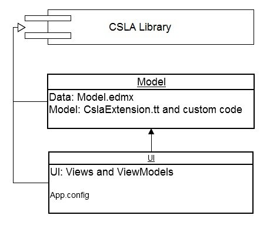
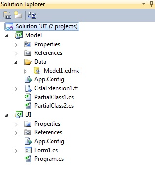
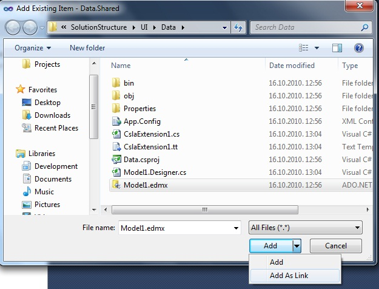

# Visual Studio Solution Setup

Here we'll discuss about Visual Studio solution setup for WindowsForms and WPF applications, but similar rules apply to Silverlight and other types of applications. 

When working with CslaExtension you should follow common best practices for your code organization. Common practice is to put UI, Business Logic and Data Access code in separate assemblies/projects. Following this rule, you should put EF data model in the DAL, CslaExtension T4 template in the BLL and create your Views and ViewModels in the UI.
However, there is one thing you should be aware of when working with Entity Framework: **automated code generation works only if EF model and T4 template reside in the same project**. This is problem not only for CslaExtension, but for all code generation templates like POCO and others. Code generation works, but every time EF model changes, you must right click on the template and select "Run custom tool" in order to generate code. 
This problem can be solved using _Three and a half projects setup_

Let's start with the simplest solution setup:

## One project setup

Visual Studio Solution

This setup is very simple and easy to use. Here we have only one project in the solution: DLL and BLL are separated using subfolders in the project. This setup is recommended for very small projects or for learning purposes.

## Two projects setup

Visual Studio Solution

This setup is also very simple to use. Here we have two projects, one for DAL and BLL, and one for UI. Code generation works automatically. Just be sure to copy connection string settings from Model to the UI project. You can use this setup during initial development and later refactor it easily to the _Three projects setup_.

## Three projects setup

Visual Studio Solution

This setup is probably something you've done before. As I said earlier, this is the most common approach when it comes to separation of application logic but there is a problem with EF automated code generation. After you change your data model, you must right click CslaExtension.tt file and "Run custom tool" in order to generate business objects. If this is acceptable, you can use this setup for your solution, and if you want automated code generation you should see _Three and a half projects setup_.

## Three and a half projects setup

Visual Studio Solution

This setup is similar to the Tree project setup but with few tweaks in order to support automated code generation. It contains 4 projects, but only 3 of them are used for the application logic. 4th project is added to support automated code generation and you never edit that project manually after you create it. That's why I named this _Three and a half projects setup_.
Let's see details of this setup:
Solid lines on the diagram represent direct references (Project -> Add reference...), and dotted lines represent indirect (weak) references. Indirect reference means that one project uses some functionality from another, but does not reference it. In this case that is accomplished by creating item in one project and then adding that item to another project as a link (Project -> Add Existing Item -> Add as link).

How to use this setup:

* Create Data library
	* Add reference to the CSLA library (_Project -> Add Reference_)
	* Add Model.edmx (_Project -> Add new item..->Data->Ado.Net Entity Data Model_)
	* Add CslaExtension.tt to the library (_Project -> Add new item -> Visual C# items ->CslaExtension.template_)
	* Edit namespace for generated classes (Open edmx and set Csla BLL Namespace = _Model library name_)

* Create Data.Shared library
	* Add link to the Model.edmx (_Project -> Add existing item -> Show all files -> Data\Model.edmx -> **Add as link**_)

* Create Model library
	* Add reference to the CSLA library (_Project -> Add Reference_)
	* Add reference to the Data.Shared (_Project -> Add reference_)
	* Add link to the CslaExtension.tt (_Project -> Add existing item -> Show all files -> Data\CslaExtension.tt -> **Add as link**_)

* Create UI
	* Add reference to the CSLA library (_Project -> Add Reference_)
	* Add reference to the Model library (_Project -> Add Reference_) 
	* Copy connection string settings from the Data library

That's it. Now you're ready to write your application logic. You edit data model in the Data library and write partial classes and other code in the Model library. Data.Shared should never be edited manually.
